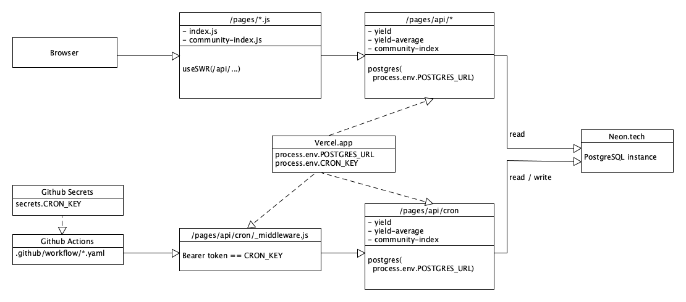

# Yield Borg

Yield Borg shows a simple chart of the different Smart Yields available on the SwissBorg platform. It is currently deployed on Vercel: [yield-borg.vercel.app](https://yield-borg.vercel.app).

## Tech Stack

* [Next.js](https://nextjs.org) app hosted on [Vercel](https://vercel.com)
* [PostgresSQL](https://www.postgresql.org) database hosted on [Neon](https://neon.tech)
* Other dependencies: [Recharts](https://recharts.org), [Tailwind CSS](https://tailwindcss.com)
* [Github Actions](https://github.com/features/actions) to check for new yields every hour
* Privacy-friendly [GoatCounter](https://www.goatcounter.com) for web analytics

## Architecture



## Local installation

```sh
# this file contains environment variables such as POSTGRES_URL and CRON_KEY
mv .env.development.local.example .env.development.local

# install dependencies and run app (available on localhost:3000)
npm install
npm run dev
```
