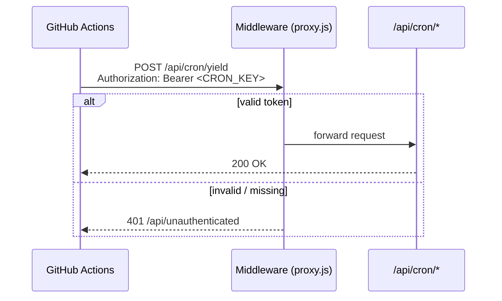

# Architecture

## Data Pipeline

SwissBorg exposes yield data through static GatsbyJS JSON endpoints. GitHub Actions workflows call the cron API routes on a schedule, which fetch from those endpoints and persist data to Neon PostgreSQL. The frontend then queries its own API routes using SWR.

```mermaid
flowchart LR
    subgraph SwissBorg
        SB[Static JSON endpoints]
    end

    subgraph GitHub Actions
        GA1[cron-yield<br/>daily 21:00 UTC]
        GA2[cron-yield-average<br/>daily 00:00 UTC]
        GA3[cron-community-index<br/>weekly Wed 13:00 UTC]
    end

    subgraph Vercel ["Vercel (Next.js)"]
        subgraph Cron ["API — cron (POST, auth required)"]
            C1[/api/cron/yield]
            C2[/api/cron/yield-average]
            C3[/api/cron/community-index]
        end
        subgraph Public ["API — public (GET)"]
            P1[/api/yield]
            P2[/api/yield-average]
            P3[/api/community-index]
        end
        FE[Frontend<br/>SWR + Recharts]
    end

    subgraph Neon
        DB[(PostgreSQL)]
    end

    GA1 -->|POST + Bearer token| C1
    GA2 -->|POST + Bearer token| C2
    GA3 -->|POST + Bearer token| C3

    C1 -->|got| SB
    C3 -->|got| SB

    C1 --> DB
    C2 --> DB
    C3 --> DB

    FE -->|useSWR| P1
    FE -->|useSWR| P2
    FE -->|useSWR| P3

    P1 --> DB
    P2 --> DB
    P3 --> DB
```

## Cron Authentication

All `/api/cron/*` routes are protected by a Next.js middleware (`proxy.js`). Requests must carry `Authorization: Bearer <CRON_KEY>`. Unauthenticated requests are redirected to `/api/unauthenticated` (401).



## Database Schema

| Table | Description |
|---|---|
| `earn_strategies` | One row per SwissBorg earn strategy (currency, protocol, active flag) |
| `yields` | Daily APY values per strategy |
| `yield_averages` | Pre-computed averages (standard, community, pioneer, genesis tiers) |
| `community_indices` | Weekly SwissBorg Community Index values |

## Frontend

Pages use [SWR](https://swr.vercel.app) for data fetching — no `getServerSideProps`. Chart settings (time frame, line type, asset visibility, selected tier) are persisted in browser cookies with a 10-year max-age.

```mermaid
flowchart TD
    Page["pages/index.js"] --> Chart[yield-chart.js]
    Page --> Settings[yield-chart-settings.js]
    Page --> Averages[yield-averages.js]

    Chart -->|useSWR /api/yield| API1[/api/yield]
    Averages -->|useSWR /api/yield-average| API2[/api/yield-average]

    Chart --> Recharts[Recharts LineChart]
    Chart --> Tooltip[yield-chart-tooltip.js]
```
